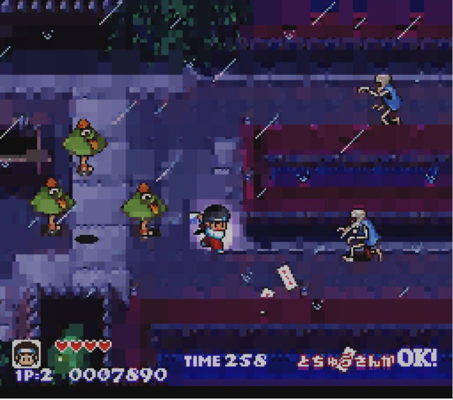

# cpsc221
Completed labs and assignments from CPSC 221 Data Structures and Algorithms

### Programming Assignment 1 ###
- Used 2D linked grids to represent HSLAPixels from a PNG
- Implemented functionsn to render and carve PNGs
- Managed dynamic memory in a large program with complex code

  
  

### Programming Assignment 2 ###
- Used Stacks, queues, and priority queues to flood fill various images
- Implemented BFS and DFS search with three different fill patterns
- Utilized functors to change individual pixels on PNGs

   
  

### Programming Assignment 3 ###
- Used binary trees to represent HSLAPixels from a PNG
- Flipped, pruning, constructed and manipulated PNGS using tree traversals

   
   
  

### Lab-Intro: ###
- Manipulated PNG images using HSLAPixels

### Lab-Debug: ###
- Found and fixed bugs in sketchify.cpp (a program to trace the outline of a PNG)
- Used gdb to debug

### Lab-LinkedLists: ###
- Implemented linked list methods

### Lab-Quacks ###
- Practiced creating recursive functions
- Created recursive and iterative functions to manipulate stacks and queues

### Lab-Trees ###
- Manipulated binary trees
- Utilized InOrder, PreOrder, and PostOrder traversals

### Lab_Dict ###
- Using memoization to optimize recursive functions
- Implementing various functions to iterate through and manipulate large dictionaries

### Lab_AVL ###
- Implemented methods for AVL trees
